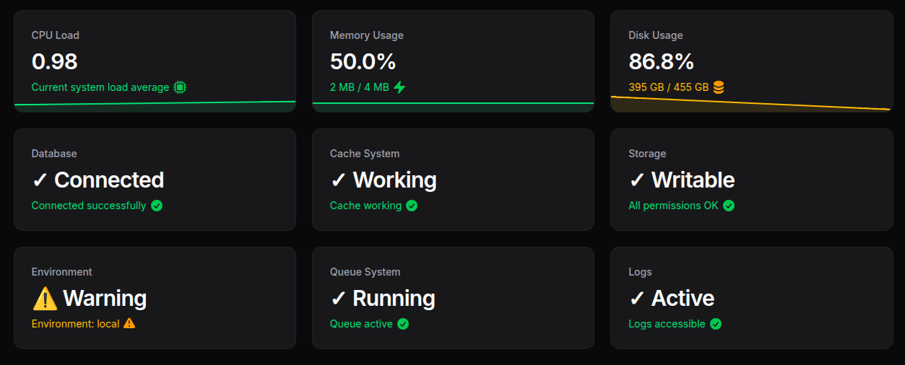

# Filaforge System Widget

A Filament v4 ## Usage

After installation and registration, the "System Monitor" widget automatically appears on your Filament dashboard. The widget displays:

- **System Metrics**: Real-time CPU, memory, and disk usage
- **Server Information**: Operating system and server details
- **Performance Indicators**: Visual performance metrics
- **Resource Monitoring**: Track system resource consumption
- **Automatic Updates**: Real-time data refresh

The widget is designed to provide a quick overview of your server's health directly from your dashboard.

## Configuration

The plugin works out of the box. You can customize monitoring settings by publishing the configuration:

```bash
php artisan vendor:publish --tag="system-widget-config"
```

## Features

- ✅ Real-time system monitoring widget
- ✅ CPU, memory, and disk tracking
- ✅ Clean dashboard integration
- ✅ Automatic data refresh
- ✅ Responsive design
- ✅ Performance visualization

---

**Package**: `filaforge/system-widget`  
**License**: MIT  
**Requirements**: PHP ^8.1, Laravel ^12, Filament ^4.0 widget plugin for real-time system monitoring, using a unique namespace to avoid collisions.



## Requirements
- PHP >= 8.1
- Laravel 12 (illuminate/support ^12)
- Filament ^4.0
- symfony/process ^7.0

## Installation

### Step 1: Install via Composer
```bash
composer require filaforge/system-widget
```

### Step 2: Service Provider Registration
The service provider is auto-discovered, so no manual registration is required.

### Step 3: Publish Assets (Optional)
If the plugin includes publishable assets, you can publish them:
```bash
php artisan vendor:publish --provider="Filaforge\SystemWidget\SystemWidgetServiceProvider"
```

### Step 4: Register the plugin in your panel
```php
use Filaforge\SystemWidget\SystemWidgetPlugin;
use Filament\Panel;

public function panel(Panel $panel): Panel
{
    return $panel
        // ...
        ->plugin(SystemWidgetPlugin::make());
}
```

## Usage
After registration, the “System Monitor” widget appears on the dashboard.

---
Package: `filaforge/system-widget`# Filaforge System Monitor

A Filament v4 dashboard widget for real-time server monitoring.

## Installation

1) Require the package (this repo is included as a local path repo in this project):

```
composer require filaforge/system-monitor
```

2) Publish the config (optional):

```
php artisan vendor:publish --tag=config --provider="Filaforge\SystemMonitor\Providers\SystemMonitorServiceProvider"
```

3) Register the plugin on your target panel provider:

```php
use Filaforge\SystemMonitor\SystemMonitorPlugin;

public function panel(\Filament\Panel $panel): \Filament\Panel
{
    return $panel
        // ...
        ->plugin(SystemMonitorPlugin::make());
}
```

The widget will be available on the dashboard and only visible to authorized users, based on the `allow_roles` setting in the published config.
